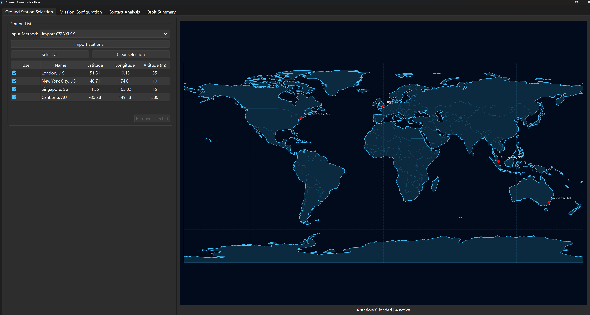
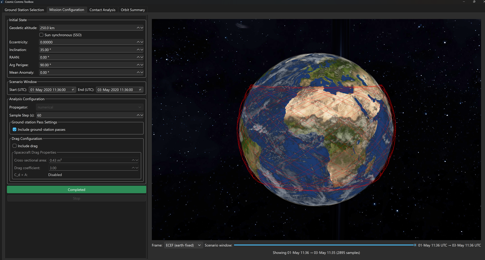
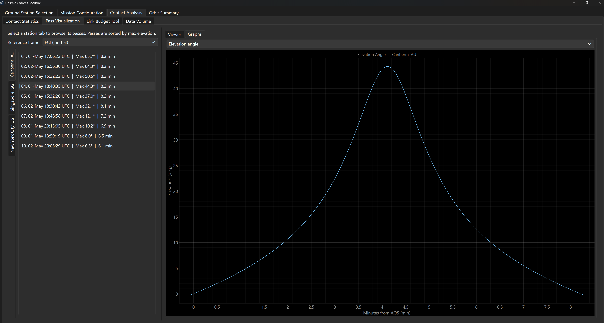
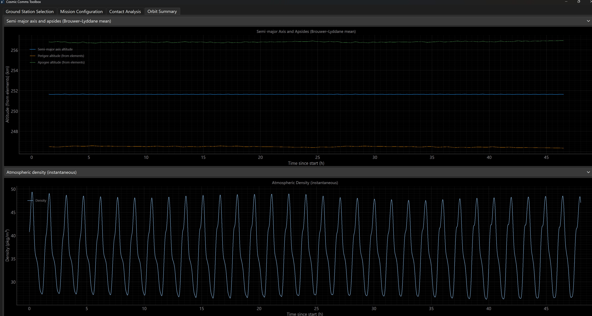
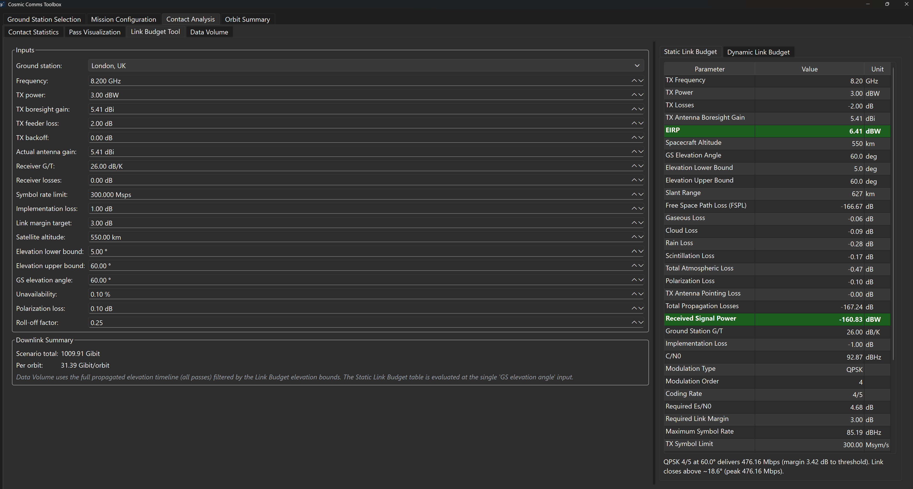

# Cosmic Comms Toolbox

A **PySide6** desktop application to support the design of spacecraft communication systems and to enable fast-iteration trade studies:
**orbit propagation**, **ground-station contact analysis**, **pass visualization**,
**link budget**, and **data volume** — all in one GUI powered by **Orekit**.

> The app title in the UI is **“Cosmic Comms Toolbox”** and the entry point is `src/main.py`.

## Screenshots


### Main workflow tabs

- **Ground Station Selection**



- **Mission Configuration**



- **Contact Analysis**



- **Orbit Summary**



### Link budget tool



## What you can do with this tool

- **Select and manage multiple ground stations**
  - Import **CSV/XLSX** station lists (or enter a station manually)
  - Enable/disable stations for a given run
  - Preview station locations on a world map
- **Configure the mission + run propagation**
  - Scenario start/end (UTC)
  - Initial orbit via classic elements (altitude, eccentricity, inclination, RAAN, etc.)
  - Optional **Sun-synchronous inclination helper (SSO)**
  - Optional **drag** configuration (Cd and area)
  - Configurable sample step (seconds)
- **Analyze contacts**
  - Contact statistics table (AOS/LOS, duration, max elevation) across multiple stations
  - Export results to **CSV/XLSX** in `outputs/`
  - Interactive plots (timeline/Gantt-style views and histograms)
- **Visualize a pass on a 3D globe**
  - Animated playback with speed and timeline scrub
  - ECI/ECEF frame toggle
  - Per-pass plots: azimuth/elevation, rates, Doppler shift and Doppler rate
- **Compute link budgets + estimate data volume**
  - Static link budget at a chosen elevation angle
  - Dynamic link budget vs elevation (VCM step + margins)
  - Data-volume distributions (Gibit/pass, Gibit/day, rate distributions, etc.)
- **Summarize orbit evolution**
  - Instantaneous and orbit-averaged (“Brouwer–Lyddane-style”) time series for altitude,
    period, eccentricity, atmospheric density, dynamic pressure, and drag force

## Quick start

### Prerequisites

- **Python 3.10+**
  - This codebase uses modern typing syntax (e.g. `X | None`) which requires Python 3.10+.
- **Java (recommended: 11+)**
  - Orekit runs on the JVM; the Python wrapper starts/attaches to a Java VM at runtime.
- **OpenGL 3.3+ capable GPU/driver**
  - Required for the ModernGL globe used in Mission/Visualization.

### Install

**Recommended (conda)**: install the Orekit Python wrapper via **conda-forge** (Orekit’s recommended path), then install the remaining Python dependencies.

```bash
conda create -n cosmic-comms python=3.11 -y
conda activate cosmic-comms
conda install -c conda-forge orekit -y
pip install -r requirements.txt
```

Orekit’s download page explicitly recommends installing the Python wrapper from Anaconda using `conda install -c conda-forge orekit` ([Orekit download page](https://www.orekit.org/download.html)).

**Alternative (pip)**: create/activate a virtual environment, then install dependencies:

```bash
pip install -r requirements.txt
```

Notes:
- The Orekit data bundle is installed via the `requirements.txt` Git dependency (`orekit-data`).
- `cartopy` can be the hardest dependency on Windows (PROJ/GEOS). If `pip` fails,
  consider using a conda environment for geospatial deps, then install the remaining packages.

### Run

```bash
python -m src.main
```

## User guide (UI walkthrough)

### 1) Ground Station Selection

- **Import stations**: click **Import stations…** and select a **CSV/XLSX** file containing:
  - `name`, `latitude`, `longitude`, `altitude`
  - Latitude/longitude in **degrees**, altitude in **meters**
- **Starter dataset**: `resources/groundstation_list/ground_stations.csv`
- **Manual entry**: switch *Input Method* to **Manual entry**, then click **Add manual station**

### 2) Mission Configuration

- Set **Initial State** and the **Scenario Window** (UTC).
- Choose analysis options:
  - **Sample Step (s)** controls how often the orbit/geometry is sampled.
  - **Include ground-station passes** can be disabled if you only want orbit propagation outputs.
  - **Include drag** enables atmospheric drag force modeling and additional diagnostics.
- Click **Run Analysis** (you can **Stop** a running analysis).

### 3) Contact Analysis

The Contact Analysis tab is split into sub-tabs:

- **Contact Statistics**: per-pass table and export buttons (CSV/XLSX).
- **Pass Visualization**: pick a station + pass, then play/scrub the animation; view graphs.
- **Link Budget Tool**: static and dynamic link budget calculations.
- **Data Volume**: distributions derived from the propagated contact timeline + link-budget settings.

Important detail:
- Pass detection is intentionally **not** gated by a minimum elevation mask. Instead, the link budget
  (and downstream data-volume metrics) apply their own elevation bounds.

### 4) Orbit Summary

Plot instantaneous and orbit-averaged metrics over time, including (when drag is enabled):
atmospheric density, dynamic pressure, and a simple drag-force magnitude proxy.

## Data files and outputs

- **Ground station lists**: `resources/groundstation_list/`
- **Textures (globe)**: `resources/textures/`
- **Exports and generated outputs**: `outputs/`
  - Contact statistics exports are written as `outputs/contact_statistics_<timestamp>.csv|.xlsx`
- **Logs**: `application.log` (written in the repo root by default)

## Project layout

```
.
├── docs/
│   └── globe_renderer_requirements.md   # Globe renderer notes/requirements
├── resources/
│   ├── groundstation_list/              # Example station lists (CSV)
│   ├── img/                             # README/UI screenshots + app icons
│   └── textures/                        # Globe textures (earth maps, stars, etc.)
├── outputs/                             # Exports produced by the GUI
├── src/
│   ├── main.py                          # App entry point (splash, window, preload textures)
│   ├── models.py                        # Shared dataclasses for configs/results
│   ├── services/
│   │   ├── access_analysis.py           # Orekit propagation + contact sampling
│   │   └── station_importer.py          # CSV/XLSX station import
│   └── ui/
│       ├── main_window.py               # Main window + tab wiring
│       ├── opengl/                      # ModernGL globe widget + texture preload
│       └── tabs/                        # Individual tab mixins (mission, link budget, etc.)
└── tests/                               # Unit tests (some skip if heavy deps missing)
```

## Development

### Coding standards

- **PEP 8** formatting/imports/naming
- **Google-style docstrings** for public modules/classes/functions
- Inline comments should explain *why* (avoid re-stating the obvious)

### Running tests

```bash
pytest -q
```

Notes:
- GUI-centric tests may require optional heavy dependencies (`orekit`, `moderngl`, `cartopy`).
- In headless CI environments, set `QT_QPA_PLATFORM=offscreen` to allow Qt to create an off-screen context.

## Troubleshooting

- **Orekit/JVM issues**
  - Ensure Java is installed and discoverable (try setting `JAVA_HOME` if needed).
  - The app bootstraps Orekit data from the installed `orekit-data` package.
- **Black globe / OpenGL errors**
  - Confirm your GPU/driver supports **OpenGL 3.3+**.
  - Try updating graphics drivers or testing on a machine with discrete graphics.
- **`cartopy` install failures (Windows)**
  - Prefer conda for geospatial stacks, then `pip install -r requirements.txt` for remaining deps.

## License

This project is licensed under the **MIT License** — see [`LICENSE`](LICENSE) for details.
